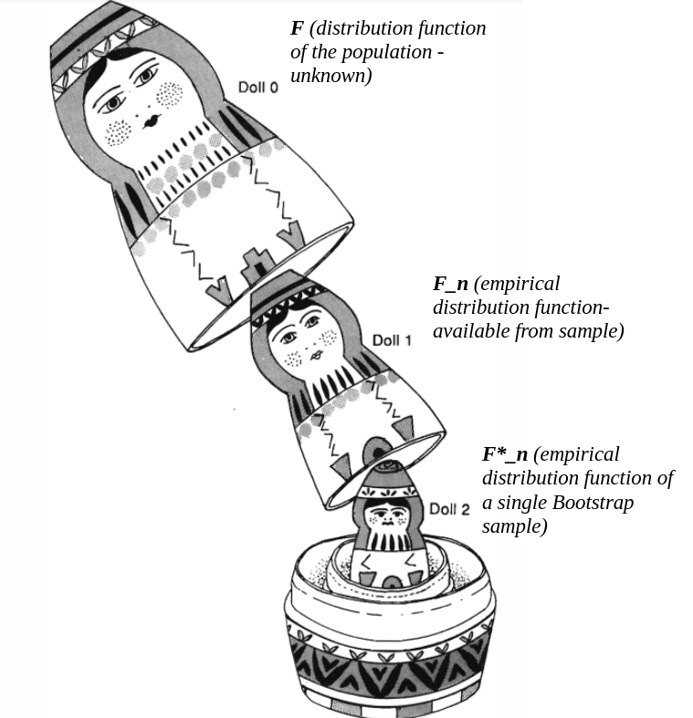

```{r setup, include=FALSE}
library(rgl)
knitr::opts_chunk$set(echo = TRUE)
knitr::knit_hooks$set(webgl = hook_webgl)
knitr::opts_chunk$set(cache = T)
```


```{css, echo=FALSE}
.extracode {
background-color: lightblue;
}
```


```{r}
seed = 20
B <- 1e3
```

# Part I: Permutational Confidence Intervals

Permutation testing (as the name suggests...) was not really born 
to make confidence intervals for given parameters, but of course, as shown in class, one can **compute exact confidence intervals** for given parameters by **performing test inversion** over a **grid of points** x.

It is relatively **computationally intensive**, thus we need a bit of "smart" code to do it.
This lab would be indeed more complex from a computational point of view than a statistical one.

Let's simulate some data...

```{r}
set.seed(seed)
data=stabledist::rstable(1000,1.5,0)  # distribution with fat tails
hist(data)
```

Let's calculate a confidence interval around the median of this distribution, that is...

```{r}
median(data)
```

What we need to do is to test over a fine grid of alternative values that contain our true one the alternative hypothesis $H_1:med(X_1) \neq \mu_0$ where $X_1$ the R.V. representing the population I have a sample of.

To do so I use a **one population test on symmetric distributions for the mean**, where my permutation scheme is made of reflections of the data

```{r}
uni_t_perm <- function(data, mu0, B = 1000) {

  data_trans <- data - mu0
  T0 <- abs(median(data_trans))
  T_perm <- numeric(B)
  n <- length(data)
  p <- 1

  for (perm in 1:B) {
    refl <- rbinom(n, 1, 0.5) * 2 - 1
    refl <- matrix(refl, nrow=n,ncol=p,byrow=FALSE) 
    T_perm[perm] <- abs(median(as.matrix(data_trans) * refl))
  }

  return(sum(T_perm >= T0)/B)
}

```

To have a reasonable spatial resolution we need to have a fine grid on which to perform our tests... which means that we need to run A LOT of tests.
Observe that for each hypothesised mean (one element in the grid) we will have a test and its corresponding **probability of observing an equally or more extreme value for the test statistic with respect to the permutational distribution under $H_0$ ** (that is, the p-value).
Hence, we will have a family of hypotheses testing each for a different mean:

$$
H_{0,s}: MED(X_1) = \mu_s\;\; vs. \;\; H_{1,s}: MED(X_1) \neq \mu_s\; s \in \mathcal{S}
$$
where $\mathcal{S}$ represents the set of gridpoints: 
```{r}
grid=seq(-3,3,by=0.001)
length(grid)
```

How to do it quickly on R? Vectorise operations instead of using for cycles.
How to do it even faster? Parallelise such vectorised operations!

Let's read the needed packages

```{r}
library(pbapply)
library(parallel)
```

Let's create the cluster and initialize it.
I need to start by understanding how many (logical...) cores my machine has.
In my case I have...

```{r}
n_cores <- detectCores()
n_cores
```

So, let's create a cluster with `n_cores` cores!

```{r,eval=F}
cl = parallel::makeCluster(min(c(n_cores, 4)))
```

I also need to "initialise" my cluster by sending information that are useful for the computation.

```{r}
clusterExport(cl,varlist=list("data","uni_t_perm"))
```

Now, I need to wrap up my function in a "wrapper" with the required arguments, and then start my parallel calculation!

```{r}
perm_wrapper <- function(grid_point) {
  uni_t_perm(data, grid_point, B = 2000)  # run a permutational t test where the hypothesised mean is the grid_point
}

pval_function <- pbsapply(grid, perm_wrapper) # TODO
```

```{r}
alpha <- 0.05  # set the significance level
plot(grid, pval_function, type = "l")  # plot p-value function
values.within.CI <- grid[pval_function > alpha]
CI <- range(values.within.CI)  # obtain the confidence interval
abline(v=CI[1], col="red")
abline(v=CI[2], col="red")
```


# Part II: Bootstrap inference

## Boostrap tests and Bootstrap P-Values

You have probably already realised how close (but yet quite different) permutational and bootstrap methods are. We have actually seen how to create confidence intervals out of a permutation test... Here we will create a test (and compute p-values!) out of a bootstrap confidence interval.

Recall that when we have a (univariate, multivariate or even functional) sample of underlying **unknown** distribution function $F$ ("real world")
$$
\mathcal{X} = x_1, ... , x_N \stackrel{iid}{\sim} F
$$
and are interested in the value of a statistic of the population $\theta(F)$ which is unknown. For that, we have sample estimand $\hat{\theta}(\mathcal{X})$. To estimate the sampling distribution of such statistic, we "substitute" $\theta(F)$ by $\hat{\theta}(\hat{F}) = \hat{\theta}(\mathcal{X})$ and $\hat{\theta}(\mathcal{X})$ with
$\hat{\theta}(\mathcal{X}^*)$
So we can draw up to $n!$ different Bootstrap samples ( _id est_ samples with replacement) of the type:
$$
\mathcal{X}^* = x_1^*, ... , x_N^* \stackrel{iid}{\sim} \hat{F}
$$
This could be more easily grasped by the матрёшка metaphor (Hall, Peter. The bootstrap and Edgeworth expansion. Springer Science & Business Media, 2013).

The outermost matrioska represents the unknown $F$, and we try to reproduce the relationship between $\hat{F}$ and $F$ (outermost and second-outermost matrioskas)
by looking ath the second ($\hat{F}$, available by the sample) and third matrioskas (available by sampling with replacement.)





Let's start by generating some data

```{r}
set.seed(seed)
x1=stabledist::rstable(1000,1.8,0)

# Plot data
hist(x1)
boxplot(x1, main = 'X1')
```

We want to perform a test on the median of this distribution, namely 
$$
H_0:median(X_1)=0\;vs\;H_1:median(X_1)\neq0
$$
Let's start by computing the sample median:

```{r}
T.obs <- median(x1)
T.obs
```


Now, we need to compute the bootstrap distribution of the sample median. To do this I will show you an advanced (and parallel...) technique. Let's set up the cluster

```{r}
cl=parallel::makeCluster(parallel::detectCores()/2)
parallel::clusterExport(cl=cl,list('x1'))


```

And now, let's directly compute

```{r}
T.boot=pbreplicate(B,  
                   median(sample(x1, replace = T)),
                   cl=cl)
```

Again, let's observe the distribution

```{r}
plot(ecdf(T.boot), main='Sample median')
abline(v = T.obs, lty=2)
```

And compute the bias, variance, and RMSE

```{r}
var=var(T.boot)
var
bias=mean(T.boot)-T.obs
bias
RMSE=sqrt(var+bias^2)
RMSE

```

We can calculate the reverse percentile intervals from the bootstrap distribution:

```{r}

alpha <- 0.05

right.quantile <- quantile(T.boot, 1 - alpha/2)
left.quantile  <- quantile(T.boot, alpha/2)


CI.RP <- c(T.obs - (right.quantile - T.obs), T.obs - (left.quantile - T.obs))
names(CI.RP)=c('lwr','upr')

plot(ecdf(T.boot), main='Sample median')
abline(v = T.obs, lty=2)
abline(v = CI.RP)
```

How do I compute the p-value of such test? I know that the p-value is the lowest alpha level for which I reject $H_0$. This value can be found via a grid search (that is computationally intensive, I know... but we know how to write fast code in R, don't we?)

```{r}
alpha_grid=seq(0.001,0.5,by=0.001)
length(alpha_grid)
```

Let's compute the list of confidence intervals: I start by creating a function to be iterated...

```{r}
CI_calc=function(alpha_level){
  right.quantile <- quantile(T.boot, 1 - alpha_level/2)
  left.quantile  <- quantile(T.boot, alpha_level/2)
  out=c(T.obs - (right.quantile - T.obs), T.obs - (left.quantile - T.obs))
  names(out)=c('lwr','upr')
  return(out)
}
```


which I then iterate using lapply

```{r}
CI_list=pblapply(alpha_grid,CI_calc)
CI_mat=dplyr::bind_rows(CI_list)
```

And, I can now check if $0$ is contained in the CI... The values are sorted, so the first one that does not contain $0$ is the first one of the vector...

```{r}
check=CI_mat[,1]>0 | CI_mat[,2]<0
(alpha_grid[check])[1]
```

So, I do not (as expected) reject $H_0$


## Bootstrapping and Nonlinear Regression

For our laboratory on Boostrapping, knowing that you've already seen some interesting feats in class, I decided to focus on an area where the impact of non-parametric inferential techniques are really powerful: non-linear regression.

Let's start by loading and displaying some data, regarding the growth of some orange trees (specifically, the diameter of their trunk)

```{r}
rm(list=ls())
data("Orange")
Orange
```

You see that we have a longitudinal dataset, with repeated measurements for 5 different trees. Let's select just one of them

```{r}
O_3 <- subset(Orange, Orange$Tree == 3)
attach(O_3)
# let's have a look at the data
plot(age, circumference, main = "Circumference of Tree #3",
  xlab = "Time (days)", ylab = "Circumference")
```

The temporal evolution of the circumference seems to be relatively well described by a logistic curve... How can I estimate it?

```{r}
logistic <- function(t, L, k, midpoint) {
  L/(1 + exp((midpoint - t)/k))
}
```

Here $t$ is the independent variable, $L$ is the asymptote parameter, $k$ is the growth rate and $midpoint$ is the point in time when the derivative of the curve is at its maximum level (the peak, if you want an epidemic analogy).
How do I estimate the parameters $L, k,midpoint$ in such nonlinear relationship? I use `nls`.

```{r}
model <- nls(circumference ~ logistic(age, L, k, midpoint),
  start = list(L = 150, k = 500, midpoint = 700),  # initialise variables for optimisation
  data=O_3)

summary(model)
```

Let's plot the estimated curve now: I need to start by generating my predictions on a fine grid

```{r}
age_fine <- seq(0, 2500)
circumference_fine <- predict(model, list(age = age_fine))
```

Then I plot my original points, and I overlay to them the predicted curve

```{r}
plot(age, circumference, main = "Fitted curve vs data",
  xlim = c(0, 2500), ylim = c(20, 200))
lines(age_fine, circumference_fine, col = "red")
```

What if I want to make inference about these parameters? Either I impose a parametric model on the error term, or, as you expect, I can use the boostrap.

Let's start then by computing the residuals:

```{r}
fitted.obs <- predict(model)
res.obs <- circumference - fitted.obs
```

And, let's start by computing confidence intervals for the asymptote parameter

```{r}
library(progress)
L.obs <- summary(model)$parameters[1, 1]
T.boot.L <- numeric(B)
formula.b <- response.b ~ logistic(age, L, k, midpoint)

pb <- progress_bar$new(
  format = "  processing [:bar] :percent eta: :eta",
  total = B,
  clear = FALSE)

set.seed(seed)

for (b in 1:B) {
  response.b <- fitted.obs + sample(res.obs, replace = T)
  fm.b <- nls(formula.b, start = list(L = 150, k = 500, midpoint = 700),
              data=list(response.b=response.b, age=O_3$age))
  sm.b <- summary(fm.b)
  T.boot.L[b] <- sm.b$parameters[1, 1]
  pb$tick()
}
```

let's now compare the bootstrap distribution of the parameter with the parameter itself...
```{r}
hist(T.boot.L, main='Asymptote Bootstrap p.m.f.')
abline(v=L.obs, lty=2)
```

```{r}
plot(ecdf(T.boot.L), main='Asymptote Bootstrap cdf')
abline(v=L.obs, lty=2)
```

Using the Bootstrap distribution of the parameter, I can compute without the need of distributional assumptions and/or approximations the standard deviation of the estimate of this parameter.

```{r}
sd(T.boot.L)
```

As well as its bias

```{r}
bias <- mean(T.boot.L) - L.obs

MSE <- var(T.boot.L) + (bias)^2

```

What if I want to compute a confidence interval around the parameter? I can use the classical reverse-percentile approach:

```{r}
alpha <- 0.05
right.quantile.L <- quantile(T.boot.L, 1 - alpha/2)
left.quantile.L <- quantile(T.boot.L, alpha/2)

CI.RP.L <- c(L.obs - (right.quantile.L - L.obs),
             L.obs,
             L.obs - (left.quantile.L - L.obs))
names(CI.RP.L) <- c("lwr", "lvl", "upr")
CI.RP.L
```

And, let's visualize them

```{r}
attach(O_3)
plot(ecdf(T.boot.L), main = "L")
abline(v = L.obs, lty = 2)
abline(v = CI.RP.L)

plot(age, circumference, main = "Fitted curve vs data",
     xlim = c(0, 2500), ylim = c(20, 200))
lines(age_fine, circumference_fine, col = "red")
abline(h = L.obs, lty = 2)
abline(h = CI.RP.L)
```


#### ANOVA with the Bootstrap

You have already seen the Bootstrap linear regression in the lectures with Prof. Vantini. For the sake of completeness, let us use the  `chickwts` dataset.

```{r}
attach(chickwts)
g <- nlevels(feed)
n <- dim(chickwts)[1]


plot(feed, weight, xlab='treat',col=rainbow(g),main='Original Data')
```
The null hypothesis that we want to test is that, being
$\tau_i, i\in \{1,\ldots6\}$ the generic effect of a given level of the
treatment. 

$$
H_0: \tau_i=0\;\forall i\;vs\;H_1:\exists\,\tau_i\neq0 
$$
And we use the $F$ statistic for the global test:
```{r}
fit <- lm(weight ~ feed)
summary(fit)
T0 <- summary(fit)$fstatistic[1]  # extract the test statistic
T0

```
And now we estimate via M.C. the Bootstrap distribution of such statistic.
For that, remember we first need to estimate the model under $H_0$ to exchange the residuals. Since the model under $H_0$ is the empty model, whence:
```{r}
y.fitted <- mean(weight)
residuals.H0 <- weight - y.fitted
```


```{r}
T_stat <- numeric(B) 
n <- dim(chickwts)[1]

for(perm in 1:B){
  # Permutation:
  permutation <- sample(1:n, replace = T)
  residuals.perm <- residuals.H0[permutation]
  y.perm <- y.fitted + residuals.perm
  fit_perm <- lm(y.perm ~ feed)
  
  # Test statistic:
  T_stat[perm] <- summary(fit_perm)$fstatistic[1]
}
```

```{r}
hist(T_stat,xlim=range(c(T_stat,T0)),breaks=30,
     main="Bootstrap distribution of T0 under H_0")
abline(v=T0,col=3,lwd=2)
# p-value
p_val <- sum(T_stat>=T0)/B
p_val
```


# Part III: Monte Carlo estimation

We firstly simulate (functional) data.

```{r}
# significance level
ALPHA <- 0.05

# same as Lab03
library(roahd)
n <- 20
P <- 101
grid <-  seq( 0, 1, length.out =  P)
alpha <-  .1
beta <-  100
C_st <- exp_cov_function( grid, alpha, beta )

m1 <- sin(pi*grid)+sin(2*pi*grid)

set.seed(seed)
data.m1 <- generate_gauss_fdata(N = n,centerline = m1,Cov=C_st)

f_data <- fData(grid,data.m1)
plot(f_data, main="Functional dataset, n=20")

```


Now, if for each of the $n=20$ functional data I took their values in **only two elements of the domain** (instead of at different values between $0$ and $1$) I would _ipso facto_ have the necessary a vector of *bivariate data*.
```{r}
data.m1.paired.univariate <- data.m1[,1:2]
data.m1.paired.univariate
```
That is, we only have the observations at the first two grid points of the function.


Let us explore visually the dataset:
```{r}
indices.obs <- c(1, 2, 4, 5) # the ones we used for x and y

f_data <- fData(grid[indices.obs], data.m1[, indices.obs])
plot(f_data)
abline(v=grid[indices.obs]) # points where take the values to produce x and y bivariate samples.
```

## MC for Permutation tests

The usual loops of $B$ iterations are nothing but a Monte Carlo algorithm we utilise to estimate the Permutational distribution of a statistic (_e.g._ the sample mean). But what happens if we increase $B$? We will have the MC convergence...

Let us reuse the data of the univariate independence test. We will see what the estimated p-value is by changing the number of MC iterations (recall that the maximum number of different permutations in this case is $n! n!$ )

What happens if we change $B$? Let us run say an MC simulation that estimates the p-value with the Permutational distribution of the statistic.

Moreover, let us increase $B$ to see what we get. That is, we run $B_1$ iterations of permuting, see the value, and then run more iterations until the total is $B_2$, re-compute the value with all the iterations available up until that moment, and so on and so forth.

```{r}
B.vec <- c(100, 500, 1e3, 2e3, 1e4, 5e4, 1e5)

x <- data.m1.paired.univariate[,1] 
y <- data.m1.paired.univariate[,2]

T0 <- cor(x, y)**2
pvals.B <- NULL
for (B in B.vec){
  set.seed(seed) # always the same seed for continuity
  T.perm <- NULL
  for (b in 1:B){
     x.perm <- sample(x, replace=F)
     y.perm <- sample(y, replace=F)
     r.sq.perm <- cor(x.perm, y.perm)**2
     T.perm <- c(T.perm, r.sq.perm)
  }
  
  pvals.B <- c(pvals.B, sum(T.perm>=T0)/B)
  
}
plot(x=log10(B.vec), y=pvals.B, type="b")
abline(h=pvals.B[length(pvals.B)])
  
```

And let us re-do it for different seeds. So the Bootstrap distribution we are estimating will be the same but the actual "history of resamples" we do are different.
```{r}
df.perm <- data.frame(matrix(nrow=length(B.vec), ncol=3))

for (k in 1:3){
  T0 <- cor(x, y)**2
  pvals.B <- NULL
  for (B in B.vec){
    set.seed(k) # we now set k
    T.perm <- NULL
    for (b in 1:B){
       x.perm <- sample(x, replace=F)
       y.perm <- sample(y, replace=F)
       r.sq.perm <- cor(x.perm, y.perm)**2
       T.perm <- c(T.perm, r.sq.perm)
    }
    
    pvals.B <- c(pvals.B, sum(T.perm>=T0)/B)
  }
  df.perm[,k] <- pvals.B
}
```

```{r}
row.names(df.perm) <- log10(B.vec)
matplot(df.perm, type="b", main="MC estimation of the perm p value", 
        xlab="log B", ylab="P-value")
abline(h=df.perm[,1][length(B.vec)])
```

And **in the permutational case** that p-value is exact.


## MC for the Bootstrap

Up until now, you have seen the Bootstrap convergence: (and here I am copy-pasting Prof. Vantini's code):
```{r}
# Real distribution and Bootstrap distribution of the Sample Mean
set.seed(seed)
n.grid  <- 2^(1:8)
M <- 10000
B <- 1000
x.obs.long <- runif(max(n.grid),0,4)

par(mfrow = c(2,4))
for(n in n.grid)
{
  T.real <- numeric(M)
  for(m in 1:M)
  {
    x.unif <- runif(n,0,4)
    T.real[m] <- mean(x.unif)
  }
  # the sample from which we resample
  x.obs <- x.obs.long[1:n]
  T.boot <- numeric(B)
  for(b in 1:B)
  {
    x.b <- sample(x.obs, replace = T)
    T.boot[b] <- mean(x.b)
  }
  
  plot(ecdf(T.real), main=paste('Sample mean: n =', n), col='red')
  lines(ecdf(T.boot), col='black')
}
```

So we observe that as $n \rightarrow +\infty$, the Bootstrap distribution (_i.e._ the distribution we get by resampling **conditional** on a fixed sample) of the statistic converges to the true distribution of the statistic.

Let us fix the sample (and thus also $n$)
```{r}
n <- 2**5
x.obs <- x.obs.long[1:n]
```


We can visualise as well the MC convergence with different seeds to the
In this case, we are plotting the mean of the (estimated via MC) Bootstrap distribution of the statistic (which in this case is the mean, but could be a quantile, a p-value, a median, _et cetera_)

Note that the Bootstrap distribution we are estimating is the one **conditional on the fixed sample**.

```{r}
df.boot <- data.frame(matrix(nrow=length(B.vec), ncol=5))

for (k in 1:5){
  T.B <- NULL
  for (B in B.vec){
    set.seed(k) # always the same seed for continuity
    T.boot <- numeric(B)
    for (b in 1:B){
      x.b <- sample(x.obs, replace = T)
      T.boot[b] <- mean(x.b)
    }
    T.B <- c(T.B, mean(T.boot))
  }
  df.boot[,k] <- T.B
}

```

```{r}
row.names(df.boot) <- log10(B.vec)
matplot(df.boot, type="b", main="MC estimation of the mean of boot distrib", 
        xlab="log B", ylab="Mean of estimated Boot distrib")
abline(h=df.boot[,1][length(B.vec)])
```


Hold on... even if we estimate perfectly the Bootstrap distribution, we still have an error. We know that the actual mean of the distribution is $2$, not $1.865$...
this is due to the **Bootstrap error**, which vanishes as $n \rightarrow +\infty$, as we saw with Prof. Vantini's code.

Let us keep the fix seed, variate $B$ and also the observed sample, which is the one that **induces the Bootstrap distribution**. 

We will see that as $B$ increases, the MC estimation converges, but to the Bootstrap estimate, which may differ from the true value using the population distribution.

```{r}
# two different samples (which will have two different Bootstrap distribs)
set.seed(20)
x.obs.1 <- runif(n,0,4)
x.obs.2 <- runif(n,0,4)

df.boot <- data.frame(matrix(nrow=length(B.vec), ncol=4))

for (k in 1:4){
  x.obs <- ifelse(k<=2, x.obs.1, x.obs.2 )
  T.B <- NULL
  for (B in B.vec){
    set.seed(k) # always the same seed for continuity
    T.boot <- numeric(B)
    for (b in 1:B){
      x.b <- sample(x.obs, replace = T)
      T.boot[b] <- mean(x.b)
    }
    T.B <- c(T.B, mean(T.boot))
  }
  df.boot[,k] <- T.B
}

```
```{r}
row.names(df.boot) <- log10(B.vec)
matplot(df.boot, type="b", main="MC estimation of the mean of 2 boot distribs", 
        xlab="log B", ylab="Mean of estimated Boot distribs")
abline(h=df.boot[,1][length(B.vec)], col="green")
abline(h=df.boot[,3][length(B.vec)], col="green")
abline(h=2, col="red", lty=1)
```

## Bootstrap t intervals 

In the previous lab, we saw reverse percentile intervals with the Bootstrap. Let us compute Bootstrap-t intervals for the mean.

We can generalise a univariate random variable as if it were a stochastic process, where the "dominion" or family of random variables is a singleton.
$$
X(s) , \; s \in \mathcal{S}
$$
where for univariate data:
$$
\mathcal{S} = \{1\}
$$
$p$-variate data
$$
\mathcal{S} = \{1, ..., p\}
$$
and for functional data, w.l.o.g:
$$
\mathcal{S} = [0,1]
$$

Let us start with univariate data. 

```{r}
n <- 32
m1 <- sin(pi*grid)+sin(2*pi*grid)
func.data.sample <- generate_gauss_fdata(n, centerline=m1, Cov=C_st)
x.univar <- func.data.sample[,1]
```
We are interested in a Bootstrap-t interval for $\mathbb{E}[X(t_1)]=\mu(t_1)$. So by applying the Bootstrap principle, we will the t-statistic 
$$
 t(s_1) = \frac{\hat{\mu}(s_1)-\mu(s_1)}{\hat{\sigma}(s_1)}
$$
by its "Bootstrap world estimate"
$$
 t^*(s_1) = \frac{\hat{\mu}^*(s_1)-\hat{\mu}(s_1)}{\hat{\sigma}^*(s_1)}
$$
So we first estimate through MC the Bootstrap distribution $t^*(s_1)$:
```{r}
B <- 1e3
mu.hat <- mean(x.univar)
sigma.hat <- sd(x.univar)

set.seed(seed)
t.boot <- as.numeric(B)
for (b in 1:B){
  x.boot <- sample(x.univar, replace=T)
  mu.boot <- mean(x.boot)
  sigma.boot <- sd(x.boot)
  
  t.boot[b] <- (mu.boot - mu.hat) / sigma.boot
}
hist(t.boot)
abline(v=0, col="pink", cex=2)
```


once we have the estimation of the Bootstrap distribution of the t statistic at $s_1$, _i.e._ of $t^*(s_1)$, we can compute the confidence interval for the mean. Denoting $\hat{q}_{\alpha/2}(s_1)$ and $1-\hat{q}_{\alpha/2}(s_1)$ the quantiles of $t^*(s_1)$:

$$
1- \alpha = \mathbb{P}[\hat{q}_{\alpha/2}(s_1) < t^*(s_1) < \hat{q}_{1-\alpha/2}(s_1)]
$$
which by the Bootstrap principle approximates:
$$
\approx \mathbb{P}[\hat{q}_{\alpha/2}(s_1) < t(s_1) < \hat{q}_{1-\alpha/2}(s_1)]
$$
We substitute by the definition:
$$
= \mathbb{P}[\hat{q}_{\alpha/2}(s_1) < \frac{\hat{\mu}(s_1)-\mu(s_1)}{\hat{\sigma}(s_1)} < \hat{q}_{1-\alpha/2}(s_1)]
$$
$$
= \mathbb{P}[\hat{q}_{\alpha/2}(s_1)\hat{\sigma}(s_1) <{\hat{\mu}(s_1)-\mu(s_1)} < \hat{q}_{1-\alpha/2}(s_1)\hat{\sigma}(s_1)]
$$
$$
= \mathbb{P}[\hat{q}_{\alpha/2}(s_1)\hat{\sigma}(s_1) - \hat{\mu}(s_1) < -\mu(s_1) < \hat{q}_{1-\alpha/2}(s_1)\hat{\sigma}(s_1) - \hat{\mu}(s_1)]
$$
and switching the sign:
$$
= \mathbb{P}[ \hat{\mu}(s_1) - \hat{q}_{\alpha/2}(s_1)\hat{\sigma}(s_1) > \mu(s_1) > \hat{\mu}(s_1) - \hat{q}_{1-\alpha/2}(s_1)\hat{\sigma}(s_1)]
$$
that is, the quantiles are "reversed".

Since we already have the MC estimate of the Bootstrap distribution $t^*(s_1)$, we just compute the quantiles and build the C.I.:

```{r}
q.low <- quantile(t.boot, ALPHA/2)
q.up <- quantile(t.boot, 1-ALPHA/2)
CI <- c(lower=mu.hat - q.up * sigma.hat,
        point=mu.hat,
        upper=mu.hat - q.low * sigma.hat)
CI
```
which includes the true mean
```{r}
m1[1]
```

Now, we can also build a **one-at-a-time** CI for multivariate and functional data.
We say one-at-a-time because they are valid 
```{r}
B <- 1e3
mu.hat <- colMeans(func.data.sample) #point-wise mean
sigma.hat <- apply(func.data.sample, MARGIN=2, FUN=sd)

set.seed(seed)
t.boot <- matrix(nrow=B, ncol=length(grid))
for (b in 1:B){
  boot.indices <- sample(1:n, replace=T)
  boot.sample <- func.data.sample[boot.indices,]

    mu.boot <- colMeans(boot.sample) 
    sigma.boot <- apply(boot.sample, MARGIN=2, FUN=sd)
  
  t.boot[b,] <- (mu.boot - mu.hat) / sigma.boot # the Bootstrapped sigma
}

# let us visualise the first three point-wise bootstrap distribitutions for t*

boxplot(rbind(t.boot[,1], t.boot[,2], t.boot[,3]) ~ (rbind(rep(1,B), rep(2,B),rep(3,B))))
lines(m1[1:3], col="pink")
```


Now, let us calculate and plot the pointwise confidence intervals!
```{r}
q.s.low <- apply(t.boot, MARGIN=2, FUN=quantile, probs=ALPHA/2)
q.s.up <- apply(t.boot, MARGIN=2, FUN=quantile, probs=1-ALPHA/2)

lower.s <- mu.hat - q.s.up * sigma.hat
upper.s <- mu.hat - q.s.low * sigma.hat

matplot(y = cbind(lower.s, upper.s), type="b",
          pch = c(2,2), col=c(14,14), lty = c(3,3),
          main = "Pointwise Bootstrap-t interval")
lines(m1, type="l", lty = 4)
lines(mu.hat, type="b", col="green")
```

Note that these confidence intervals are point-wise, meaning they are **not simultaneous**.
This means that if we were to do inference on the mean function $\mu(s)$, we would **NOT** build the bands this way, but with a procedure to control **family-wise error rate** (where of course the whole family is denoted by $\mathcal{S}$).

Hence, even if we are using the same MC to obtain the CI for every dimension, the CI is valid for inference of the value of $X(s)$ only **ONE AT A TIME**.

For Interval-Wise Testing, cfr. the previous lab.

# Part IV: Exercises


## Exercise 1
In the file clients.rda you can find data about the churning of customers of a streaming television service. After the amount of days indicated by the time variable some of the customers have cancelled their subscription (if status= 2), while some others are still active (if status= 1). Alongside this kind of information, you are also given data about the income and age of the subscriber, and a grouping based on behavioural segmentation of your customers.

Assuming all (age,income) tuples to be independent, and covariate data within behavioural groups also identically distributed, check, via a permutation test using as a test statistic the maximum norm of the absolute difference between the sample multivariate
Mahalanobis medians of the groups, if the two groups, that are different in terms of
behaviour, also have a different median for both age and income. Plot the empirical cumulative distribution function of the permutational test statistic, report the p-value of the test and comment it.

### Solution
Permutation test: $H_0: Me(group1) = Me(group2)$ vs $H_0: Me(group1) \neq Me(group2)$ where $Me$ is the multivariate Mahalanobis median

```{r warning=FALSE}
load('./data/exercises_data/clients.rda')
library(DepthProc)
age_income=dt_2[,1:2]

n1=table(dt_2$behavioural_group)[1]
n2=table(dt_2$behavioural_group)[2]


groups=split(age_income,dt_2$behavioural_group)

mean1=depthMedian(groups$'1',depth_params = list(method='Mahalanobis'))
mean2=depthMedian(groups$'2',depth_params = list(method='Mahalanobis'))

t_stat= max(abs(mean2-mean1)) 


B=200
T_dist=numeric(B)
set.seed(100)

for(index in 1:B){
  perm=sample(1:1000)
  age_income.p=age_income[perm,]
  mean1.p=depthMedian(age_income.p[1:n1,],depth_params = list(method='Mahalanobis'))
  mean2.p=depthMedian(age_income.p[(n1+1):1000,],depth_params = list(method='Mahalanobis'))
  T_dist[index]=max(abs(mean2.p-mean1.p))
}


plot(ecdf(T_dist))
abline(v=t_stat)
```

The $P-$value of the test is:
```{r,  warning=FALSE}
sum(T_dist>=t_stat)/B
```

The $P-$value is $>>0.05$, I cannot refuse $H_0$, which means that I cannot refuse the equality of the two Mahalanobis medians.


## Exercise 2
Dr. Bisacciny, Ph.D., is a former postdoctoral researcher in statistics, now turned to beekeeping.
Despite having left academia, he still likes to use his statistical background to assess his skills as a beekeeper.
To do so, he wants to compare jointly the number of bees (n.bees) and the amount of honey (honey [g/year]) produced by his 20 beehives (contained in ex01.rda) against the golden standards ($c_0$) available in the literature, that determine a Tukey median value of 10,000 bees and 10,000 g/year of honey per beehive as the optimal performance standard for a beehive similar to the ones used by Dr. Bisacciny. Assuming the tuple (bee, honey) to be i.i.d. , help Dr. Bisacciny in the following:
Using as a test statistic the euclidean distance between the sample Tukey median $\hat C$ and the golden standard $c_0$, perform a permutation test :
   
$$ H_0: C = c_0 \ \ \textrm{vs} \ \ H_1: C \neq c_0  \ , $$
   
where $C$ is the theoretical Tukey median and $c_0 = (10,000 ; 10,000)$.
After having provided the theoretical properties of the procedure provide the histogram of the permuted distribution of the test statistic, its empirical cumulative distribution function as well as a p-value for the test and comment the results.

### Solution
Plot of the data

```{r ,  warning=FALSE}
load("./data/exercises_data/ex01.rda")
plot(beehive)
```


The Tukey median is:

```{r,  warning=FALSE}

Tukey_median=depthMedian(beehive,depth_params = list(method='Tukey'))
Tukey_median
```


Histogram of permutational distribution of test statistic

```{r , warning=FALSE}

c_0=c(10000,10000)

#permutation test
# Computing a proper test statistic
# (i.e., squared distance between the sample mean vector and the hypothesized center of simmetry)
beehive_median = depthMedian(beehive,depth_params = list(method='Tukey'))

n <- dim(beehive)[1]
p <- dim(beehive)[2]

T20 <- Tukey_median

# Estimating the permutational distribution under H0
B <- 1000
T2 <- numeric(B) 

set.seed(2021)


for(perm in 1:B){
  # In this case we use changes of signs in place of permutations
  
  # Permuted dataset
  signs.perm <- rbinom(n, 1, 0.5)*2 - 1
  beehive_perm <- matrix(c_0,nrow=n,ncol=p,byrow=T) + (beehive - c_0) * matrix(signs.perm,nrow=n,ncol=p,byrow=FALSE)
  x.median_perm <- depthMedian(beehive_perm,depth_params = list(method='Tukey'))
  T2[perm]  <- (x.median_perm-c_0)  %*% (x.median_perm-c_0) 

  }

hist(T2,xlim=range(c(T2,T20)))
abline(v=T20,col=3,lwd=4)
```

Empirical cumulative distribution function
```{r ,  warning=FALSE}
plot(ecdf(T2))
abline(v=T20,col=3,lwd=4)
```

The P-Value of the test aprireis

```{r,warning=F}

p_val <- sum(T2>=T20)/B
p_val


```


The P-value is way above the selected confidence level ($\alpha = 0.05$), I can thus not refuse $H_0$, and argue that the beehives of Dr. Bisacciny do not perform differently than the golden standard $c_0$

## Exercise 3 (a bit harder)

Dr. Dry, a university professor in statistics, wants to assess if the COVID-19 pandemic and the consequent remote teaching situation has had an effect on the academic performance of his advanced statistics course. To do so, he wants to compare the distribution of the votes (contained in ex1.rda of the last edition of the course pre-COVID (votes.pre) vs the last year course (votes.post). Since he suspects a  difference in the distributions of the votes of the two exams, he asks some advice to two young researchers, who are experts in non-parametric statistics: Dr. LeFontaine and Dr. Galvanee, that suggest two different kind of analyses. They both assume the votes in votes.pre and in votes.post to be independent, and each group to be iid.

- Dr. Galvanee suspects that the two distributions are only shifted: the shape shouldn't have changed. To test this, she proposes to run the following family of permutation tests:
      $$ H_0: \mu_{post} = \mu_{pre} + \delta \ \ \textrm{vs} \ \ H_1: \mu_{post} \neq \mu_{pre} + \delta  \ , $$
with $\delta \in \left\{-5.0,-4.9,-4.8,\ldots,-0.1,0.0,0.1,\ldots,4.8,4.9,5.0\right\}$.
After having introduced a suitable test statistics, provide a plot of the $p-$value function obtained (and please use the same seed for every test). Use the $p-$value function to obtain a confidence interval for the difference between the two group means.

 - Dr. LeFontaine, instead, thinks that the very shape of the distribution also changed: to check this, he suggests test the equality of some quantiles of the two distributions. In detail, he proposes to run the following family of permutation tests:
        $$ H_0: F^{-1}_{post}(1-\alpha) = F^{-1}_{pre}(1-\alpha) \ \ \textrm{vs} \ \ H_1: F^{-1}_{post}(1-\alpha) \neq F^{-1}_{pre}(1-\alpha)  \ , $$
with $1-\alpha \in \left\{0.05,0.10,0.15,\ldots,0.85,0.90,0.95\right\}$.
    After having introduced a suitable test statistic, provide a plot of the obtained $p-$values (also here, please use the same seed for each test).
\item Comment the results of the two tests: what are the implications in terms of the equality of the two distributions?
    
### Solution

```{r}
load('./data/exercises_data/ex1.rda')
n.pre=length(votes.pre)
n.post=length(votes.post)

#create a permutation test for the difference in mean

```

#### Point 1

A suitable test statistic is $T=\left|\hat{\mu}_2 - \hat{\mu}_1 - \mu_0 \right|$
```{r}


uni_t_perm=function(data1,data2,mu0,B=1000){
  
  data1 = data1
  data2 = data2 - mu0
  t0=abs(mean(data2)-mean(data1))  
  data=c(data1,data2)  
  n.tot=length(data)
  #set.seed(1991)
  T_perm=numeric(B)
  
  for(index in 1:B){
    data_perm=sample(data,replace = F)
    data1.perm=data_perm[1:length(data1)]
    data2.perm=data_perm[(length(data1)+1):n.tot]
    
    T_perm[index]=abs(mean(data2.perm)-mean(data1.perm))
    
  }
  return(sum(T_perm>=t0)/B)
}

test.grid=seq(-5,5,by=0.1)

pval.fun=numeric(length(test.grid))


for(index in 1:length(test.grid)){
  set.seed(1991)
  pval.fun[index]=uni_t_perm(votes.pre,votes.post,test.grid[index])
}

plot(test.grid,pval.fun)


```


#### Point 2

The permutational confidence interval is

```{r}
CI=range(test.grid[pval.fun>0.05])
names(CI)=c('lwr','upr')
CI
```

This means that, at $\alpha=0.05$ the two means are not statistically different

#### Point 3

A suitable test statistic in this case is $\left| F^{-1}_{post}(1-\alpha) - F^{-1}_{pre}(1-\alpha)\right|$

```{r}


uni_quant_perm=function(data1,data2,q,B=1000){

  
t0=abs(quantile(data2,prob=q)-(quantile(data1,prob=q)))  
data=c(data1,data2)  
n.tot=length(data)

T_perm=numeric(B)

for(index in 1:B){
data_perm=sample(data,n.tot,replace = F)
data1.perm=data_perm[1:length(data1)]
data2.perm=data_perm[(length(data1)+1):n.tot]

T_perm[index]=abs(quantile(data2.perm,prob=q)-(quantile(data1.perm,prob=q)))

n=length(data)
}
return(sum(T_perm>=t0)/B)
}

test.q=seq(0.05,0.95,by=0.05)

pval.fun=numeric(length(test.q))

for(index in 1:length(test.q)){
  set.seed(1991)
  pval.fun[index]=uni_quant_perm(votes.pre,votes.post,test.q[index])
}

plot(test.q,pval.fun)
abline(h=0.05)
```

#### Point 4

The first test says that the means are equal, but the second one shows that the very first and very last quantiles are significantly different between the two distributions: this means that the two distributions are centered around the same value, but have different tail probability


## Exercise 4  

The local administration of Torgnon, a small municipality in Aosta Valley, has given you the task
to assess the probability of a flood coming from the small river that crosses the village.
To do so, they given you data about the maximum water level of the past 50 years.
The major is only willing to accept a 5% probability of flood. so your wall should be high at least
as the 95th percentile of the maximums distribution.

1. Assess the statistical quality of the sample 95th percentile, and compute a 95 percent confidence
interval for it

2. After some study, you've discovered that the maximum value of level of water is usually distributed
as a lognormal: How can you use this information? Has your estimate of the sample 95th percentile improved?


### Solution

#### Point 1

```{r}
load('./data/water_level_data/water_level.rda')

hist(water_level)
boxplot(water_level)
```

We don't know how a sample quantile is distributed... which means that to achieve what is asked in the exam I need to use bootstrapping!

```{r}
B <- 10000
water.obs=water_level

q95.obs=quantile(water.obs,0.95)
q95.boot = numeric(B)
for(b in 1:B)
{
  water.b <- sample(water.obs, replace = T)
  q95.boot[b] = quantile(water.b,0.95)
}

plot(ecdf(q95.boot))
abline(v = q95.obs) #we can observe that it's quite skewed...
```
 Let's so compute the bias and the variance of the estimator
 
```{r}
var=var(q95.boot)
bias=mean(q95.boot)-q95.obs
RMSE=sqrt(var+bias^2)
var
bias
RMSE
```
 
And for the confidence interval, let's use the classic reverse percentiles

```{r}
alpha <- 0.05

right.quantile <- quantile(q95.boot, 1 - alpha/2)
left.quantile  <- quantile(q95.boot, alpha/2)

CI.RP <- c(q95.obs - (right.quantile - q95.obs), q95.obs, q95.obs - (left.quantile - q95.obs))
CI.RP
```

#### Point 2

To solve the second part, I need to understand that I can use a parametric bootstrap, and fit a lognormal to my data.
How to fit the parameters of a lognormal distribution? do I need to do something weird? nope!

```{r}
norm_water_level=log(water_level)
hist(norm_water_level)
shapiro.test(norm_water_level)

mean=mean(norm_water_level)
sd=sqrt(var(norm_water_level))
n=length(norm_water_level)

```

Let's set our parametric bootstrap procedure

```{r}
q95.boot.p = numeric(B)

for(b in 1:B)
{
  water.b <- exp(rnorm(n,mean,sd))
  q95.boot.p[b] = quantile(water.b,0.95)
}

plot(ecdf(q95.boot.p))
abline(v = q95.obs)
```
And compute everything I need

```{r}
var.p=var(q95.boot.p)
bias.p=mean(q95.boot.p)-q95.obs
RMSE.p=sqrt(var.p+bias.p^2)

var=var(q95.boot)
bias=mean(q95.boot)-q95.obs
RMSE=sqrt(var+bias^2)

data.frame("Non Parametric"=c(var,bias,RMSE),"Parametric"=c(var.p,bias.p,RMSE.p))

```

The parametric version is then slightly better than the nonparametric one...


```{r}
alpha <- 0.05

right.quantile <- quantile(q95.boot.p, 1 - alpha/2)
left.quantile  <- quantile(q95.boot.p, alpha/2)

CI.RP.p <- c(q95.obs - (right.quantile - q95.obs), q95.obs, q95.obs - (left.quantile - q95.obs))
CI.RP.p
```

## Exercise 5

The chief coach of the Pila-Aosta ski club has tasked you to select who, among its three top-class athletes in alpine skiing, can successfully compete also in ski-cross races, which have been recently "promoted" to an alpine discipline from its former "freestyle" status.
One of the key areas in ski-cross is the moment when the athlete "jumps" in the track: this, differently from alpine skiing, happens after the blow of a whistle. For this reason, fast reaction times can make the difference between losing and winning.
You're so given the data about 100 "start" trials for the three athletes, stored in "parallel_gate.rda" The chief coach is asking if:

1. Are there any differences among the athletes? (see if you can use a parametric approach,
if not, use a permutational one)
2. From a preliminary visual analysis, athlete 3 seems the best: how can you assess this, knowing
what you discovered in 1.?
3. The coach is also asking you an idea of the "consistency" of athlete 3 out of the gate: provide him
with a confidence interval for the mean of his reaction time (use a permutational approach).

### Solution


Load the data and have a look at it


```{r}
load('./data/parallel_gate_data/parallel_gate.rda')
head(chrono)

```

let's render the data usable for analysis, namely let's convert the athlete in a factor, and let's observe the data

```{r}
chrono$athlete=factor(chrono$athlete)
summary(chrono)
attach(chrono)
boxplot(reaction_time ~ athlete)
```

Athlete 3 seems better than the others.
Let's assess if I can use a classic ANOVA

```{r}
model_norm=aov(reaction_time ~ athlete)
summary(model_norm)
shapiro.test(model_norm$residuals)
qqnorm(model_norm$residuals)
abline(a=0,b=1,col='red')
```

Normality is not verified, let's use permutational anova then

```{r}
T0 <- summary(model_norm)[[1]][1,4]

T0

B <- 1000 # Number of permutations
T_stat <- numeric(B) 
n <- nrow(chrono) 
  
  for(perm in 1:B){
    # Permutation:
    permutation <- sample(1:n)
    reaction_perm <- reaction_time[permutation]
    model_perm <- aov(reaction_perm ~ athlete)
    
    # Test statistic:
    T_stat[perm] <- summary(model_perm)[[1]][1,4]
  }

```

Let's plot the permutational distribution of the test statistic, and the ECDF

```{r}
hist(T_stat,xlim=range(c(T_stat,T0)),breaks=30)
abline(v=T0,col=3,lwd=2)

plot(ecdf(T_stat),xlim=range(c(T_stat,T0)))
abline(v=T0,col=3,lwd=4)
```
```{r}
# p-value
p_val <- sum(T_stat>=T0)/B
p_val
```

#### Point 2

To answer to the next point, you need to perform a proper post-hoc test.
Let's go with two permutational t-tests, using as a reference level the third athlete (who seems the best...)


```{r}
pooled1=chrono[athlete!=2,]
n1=nrow(pooled1)
ath_3=pooled1$athlete==3
T0=abs(mean(pooled1$reaction_time[ath_3])-mean(pooled1$reaction_time[!ath_3]))
T0


T_stat=numeric(B)
for(perm in 1:B){
  # permutation:
  permutation <- sample(1:n1)
  time_perm <- pooled1$reaction_time[permutation]
  ref_perm <- time_perm[ath_3]
  other_perm <- time_perm[!ath_3]
  # test statistic:
  T_stat[perm] <- abs(mean(other_perm) - mean(ref_perm))
}

p_val <- sum(T_stat>=T0)/B
p_val

```

Athlete 3 is better than Athlete 1


```{r}
pooled2=chrono[athlete!=1,]
n2=nrow(pooled2)
ath_3=pooled2$athlete==3
T0=abs(mean(pooled2$reaction_time[ath_3])-mean(pooled2$reaction_time[!ath_3]))
T0


T_stat=numeric(B)
for(perm in 1:B){
  # permutation:
  permutation <- sample(1:n1)
  time_perm <- pooled1$reaction_time[permutation]
  ref_perm <- time_perm[ath_3]
  other_perm <- time_perm[!ath_3]
  # test statistic:
  T_stat[perm] <- abs(mean(other_perm) - mean(ref_perm))
}

p_val <- sum(T_stat>=T0)/B
p_val

```

Athlete 3 is also better than Athlete 2

#### Point 3
We are suggested to use the permutational approach, we could nevertheless use a bootstrap one...

```{r}
uni_t_perm=function(data,mu0,B=1000){
  
  data_trans=data-mu0
  T0=abs(mean(data_trans))
  T_perm=numeric(B)
  n=length(data)
  
  for(perm in 1:B){
    
    refl <- rbinom(n, 1, 0.5)*2 - 1
    T_perm[perm]=abs(mean(data_trans*refl))
    
  }
  return(sum(T_perm>=T0)/B)
}

library(pbapply)
library(parallel)


grid=seq(0,2,by=0.001)

cl=makeCluster(2)
ath_3=reaction_time[athlete==3]


clusterExport(cl,varlist=list("ath_3","uni_t_perm"))

mean(ath_3)

perm_wrapper=function(grid_point){uni_t_perm(ath_3,grid_point)}
pval_function=pbsapply(grid,perm_wrapper,cl=cl)

plot(grid,pval_function,type='l')

range(grid[pval_function>0.05])
abline(v=range(grid[pval_function>0.05]))
```
And now the bootstrap one

```{r}
T0=mean(ath_3)
B=1000
T.boot=numeric(B)

for(b in 1:B)
{
  x.b <- sample(ath_3, replace = T)
  T.boot[b] <- mean(x.b)
}

# RP intervals

alpha <- 0.05

right.quantile <- quantile(T.boot, 1 - alpha/2)
left.quantile  <- quantile(T.boot, alpha/2)

T0
right.quantile - T0
left.quantile  - T0

CI.RP <- c(T0 - (right.quantile - T0), T0 - (left.quantile - T0))
CI.RP
range(grid[pval_function>0.05])

```
