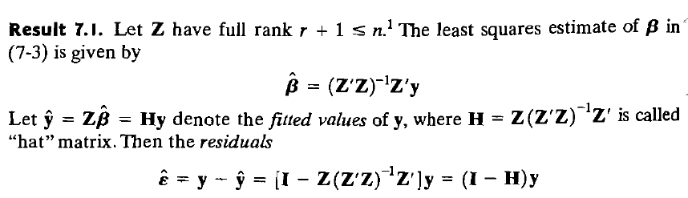

# Part 1: Global estimates

```{r setup, include=FALSE}
library(rgl)
knitr::opts_chunk$set(echo = TRUE)
knitr::opts_chunk$set(cache = TRUE)
knitr::knit_hooks$set(webgl = hook_webgl)
knitr::include_graphics(path="linear_regression_formulae.png")
ggplot2::theme_set(ggplot2::theme_bw())
```

```{css, echo=FALSE}
.extracode {
background-color: lightblue;
}
```

## Loading necessary libraries

```{r message=FALSE, warning=FALSE}
library(ISLR2)
library(car)
```


Let us familiarize with the dataset we will be using. It is something
you should remember quite well: the Wage dataset by the amazing *An Introduction to Statistical Learning* book, since August 2021 at its
second (and free!) edition available
[here](https://www.statlearning.com). It contains wage and other data
for a group of 3000 male workers in the Mid-Atlantic region. For the
moment, let us focus on the Wage and age variables only.

```{r}
data(Wage)
wage <- Wage$wage
age <- Wage$age
plot(age, wage)
```

We have a "weird" cluster of people with a VERY high wage and we observe
some kind of reverse bathtub behavior. What happens if I try to model it
linearly?

```{r}
m_linear=lm(wage ~ 1 + age)
summary(m_linear)

age.grid=seq(range(age)[1],range(age)[2],by=0.5)
# alternative age.grid <- seq(min(age), max(age), length.out=100)
preds=predict(m_linear,list(age=age.grid),se=T)
se.bands=cbind(preds$fit +2* preds$se.fit ,preds$fit -2* preds$se.fit)
plot(age ,wage ,xlim=range(age.grid) ,cex =.5, col =" darkgrey ",main='Linear Fit')
lines(age.grid,preds$fit ,lwd =2, col =" blue")
matlines (age.grid ,se.bands ,lwd =1, col =" blue",lty =3)
```

As usual, we know how to hard code it... (*cf.* the book used in Applied Statistics)




```{r, class.source="extracode"}

X <- cbind(1,age)  # design matrix including intercept
N <- nrow(X)
beta_manual <- c(solve(crossprod(X), crossprod(X, wage)))
y.hat <- c(X%*%beta_manual)
res_manual <- y.hat - wage
Cov_beta <- sum(res_manual^2)/(N-2)*solve(crossprod(X))
X_grid <- cbind(1,age.grid)
preds_manual_fit <- c(X_grid%*%beta_manual)
  preds_manual_fit_se <- sqrt(sapply(1:nrow(X_grid), function(i) t(X_grid[i,])%*%Cov_beta%*%X_grid[i,]))

```

Not very good, right?

## Polynomial Regression

The simplest way to extend linear regression to a nonlinear one is to
employ polynomial functions. Let us try to add terms to the standard
linear model:

```{r}
m_quad=lm(wage ~ age + I(age^2))
summary(m_quad)
preds=predict(m_quad,list(age=age.grid),se=T)

se.bands=cbind(preds$fit +2* preds$se.fit ,preds$fit -2* preds$se.fit)

plot(age ,wage ,xlim=range(age.grid) ,cex =.5, col =" darkgrey ",main='Quadratic Fit')
lines(age.grid,preds$fit ,lwd =2, col =" blue")
matlines (age.grid ,se.bands ,lwd =1, col =" blue",lty =3)
```

There is actually a more efficient way to do so (functional programming
tip):

```{r}
m_list=lapply(1:10,function(degree){lm(wage ~ poly(age,degree=degree))})
do.call(anova,m_list)
```

I would get the very same results with non-orthogonal polynomials

```{r}
m_list_raw=lapply(1:10,function(degree){lm(wage ~ poly(age,degree=degree,raw=T))})
do.call(what = anova,args = m_list)
```

While the manual derivation of non-orthogonal polynomials is
straightforward, orthogonal ones are defined as powers of our original
predictor that are mutually orthogonal.

If you are curious about this, take a look at [this discussion](https://stackoverflow.com/questions/26728289/extracting-orthogonal-polynomial-coefficients-from-rs-poly-function) and [also this one](https://stackoverflow.com/questions/39031172/how-poly-generates-orthogonal-polynomials-how-to-understand-the-coefs-ret)

```{r, class.source="extracode"}

x <- Wage$age
ort_poly <- poly(x,degree=2)

# First manual orthogonal polynomial: x is centered and rescaled as to have unit length
manual_poly_1 <- (x-mean(x))/sqrt(sum((x-mean(x))^2))
all(abs(ort_poly[,1]-manual_poly_1)<1e16)

# Second manual orthogonal polynomial: obtained regressing x^2 against the previous orthogonal polynomials,
# rescaling the residuals to be a vector of unit length

manual_poly_lm_2 <- lm(x^2~manual_poly_1)
manual_poly_2 <- manual_poly_lm_2$residuals/sqrt(sum(manual_poly_lm_2$residuals^2))
all(abs(ort_poly[,2]-manual_poly_2)<1e16)
```

And so on. In general, orthogonal polynomials are preferred in
regression as the situation gets badly messed up if I try classic t-test
based model selection:

```{r}
summary(m_list[[5]])
summary(m_list[[4]])
summary(m_list[[3]])
```

vs (look at the p-values)

```{r}
summary(m_list_raw[[5]])
summary(m_list_raw[[4]])
summary(m_list_raw[[3]])
```

All in all, the correct model seems to be a fourth degree polynomial.
Let us look at some diagnostics:

```{r}
plot(m_list[[4]])
```

Wait, how were those plots obtained?

```{r, class.source="extracode", eval=FALSE}
lm_4 <- m_list[[4]]
N <- length(age)
# 1
plot(x=lm_4$fitted.values,y=lm_4$residuals)

# 2
plot(qnorm(ppoints(n = N)),sort(rstandard(lm_4)))
abline(a = 0,b = 1,col="red")

# 3
plot(x=lm_4$fitted.values,y=sqrt(abs(rstandard(lm_4))))

# 4
#XX <- model.matrix(lm_4)
#diag(XX%*%solve(t(XX)%*%XX)%*%t(XX)))
plot(hatvalues(lm_4),sqrt(abs(rstandard(lm_4))))
```

Still some of the upper points are not well captured by the model, let
us try to make predictions

```{r}
preds=predict(m_list[[4]],list(age=age.grid),se=T)
se.bands=cbind(preds$fit +2* preds$se.fit ,preds$fit -2* preds$se.fit)
plot(age ,wage ,xlim=range(age.grid) ,cex =.5, col =" darkgrey ",main='Degree 4 Poly - Fit')
lines(age.grid,preds$fit ,lwd =2, col =" blue")
matlines (age.grid ,se.bands ,lwd =1, col =" blue",lty =3)
```

What happens, instead, if I try to overfit?

```{r}
preds=predict(m_list[[10]],list(age=age.grid),se=T)
se.bands=cbind(preds$fit +2* preds$se.fit ,preds$fit -2* preds$se.fit)
plot(age ,wage ,xlim=range(age.grid) ,cex =.5, col =" darkgrey ",main='Degree 10 Poly - Fit')
lines(age.grid,preds$fit ,lwd =2, col =" blue")
matlines (age.grid ,se.bands ,lwd =1, col =" blue",lty =3)
```

Notice that polynomial regression can be directly applied to GLMs:
consider the following logistic regression models

```{r}
m_list_logit=lapply(1:5,function(degree){glm(I(wage>250) ~ poly(age,degree=degree),family='binomial')})
do.call(what = anova, c(list(test="Chisq"), m_list_logit))
```

A smaller model here may suffice

```{r}
preds=predict(m_list_logit[[4]],list(age=age.grid),se=T)  


logistic <- function(x) exp(x) / (1+exp(x))
pfit = sapply(preds$fit, FUN=logistic)  # apply logistic function

se.bands.logit = cbind(preds$fit +2* preds$se.fit , preds$fit -2*
                         preds$se.fit)

se.bands = exp(se.bands.logit)/(1+ exp(se.bands.logit))  # same for std errors
#se.bands <- sapply(se.bands.logit, FUN=logistic)

plot(age ,I(wage >250) ,xlim=range(age.grid) ,type ="n",ylim=c(0 ,.2) )
points (jitter (age), I((wage >250) /5) ,cex =.5, pch ="|",
          col =" darkgrey ", main='Poly 4 Fit - Logistic')
lines(age.grid ,pfit ,lwd =2, col =" blue")
matlines (age.grid ,se.bands ,lwd =1, col =" blue",lty =3)
```

### Exercise

Considering the prestige and income variables from the Prestige of
Canadian Occupations dataset, build polynomial regression models to
explain prestige as a (non-linear) function of income

```{r}
with(Prestige,plot(income,prestige))
```

-   Is a linear function sufficient to model the relationship between
    the two variables?
-   Which degree is sufficient to consider for modeling the
    relationship?

## Step regression

Using polynomial functions of the features as predictors in a linear
model imposes a global structure on the non-linear function of X. We can
instead use step regression in order to avoid imposing such a global
structure.
The idea is to break the range of X into intervals, and treat the fact that x is in that interval as a factor. This amounts to converting a continuous
variable into an ordered categorical variable, so we have an ANOVA _ipso facto_.

Notice that, same as for
polynomials regression, the fitting procedure remains exactly equal to
the one used for linear models: we are still always using OLS here! Let
us keep working with the Prestige dataset and split the feature space X
in two bins. Ah, in case you have not noticed during the exercise, a
linear model is too restrictive here:

```{r}
with(Prestige,plot(income,prestige))
abline(lm(prestige~income, data=Prestige))
```

Cutpoint maybe around $10000$? How do we do that?

```{r}
head(Prestige$income)
attach(Prestige)
head(
       cut(income, breaks = c(min(income),10000,max(income))))
detach(Prestige)
```

Then it boils down to fit an lm with this new variable

```{r}
m_cut=lm(prestige ~ cut(income,breaks = c(-Inf,10000,max(income))), data=Prestige)
broom::tidy(summary(m_cut)) %>% 
  dplyr::mutate(term=ifelse(term=="(Intercept)",term, "income_cut(1e+04,2.59e+04]")) # all this mess to have a nice name on the summary table

```

```{r}
income.grid=with(Prestige, seq(range(income)[1],range(income)[2],by=10))
preds=predict(m_cut,list(income=income.grid),se=T)
se.bands=cbind(preds$fit +2* preds$se.fit ,preds$fit -2* preds$se.fit)
with(Prestige, plot(income ,prestige ,xlim=range(income.grid) ,cex =.5, col =" darkgrey ",main='Custom cut Fit'))
lines(income.grid,preds$fit ,lwd =2, col =" blue")
matlines(income.grid ,se.bands ,lwd =1, col =" blue",lty =3)
```

Of course we can be even more flexible

```{r}
m_cut=lm(prestige ~ cut(income,breaks=4),data = Prestige)
```

```{r}
income.grid=with(Prestige, seq(range(income)[1],range(income)[2],by=10))
preds=predict(m_cut,list(income=income.grid),se=T)
se.bands=cbind(preds$fit +2* preds$se.fit ,preds$fit -2* preds$se.fit)
with(Prestige, plot(income ,prestige ,xlim=range(income.grid) ,cex =.5, col =" darkgrey ",main='Custom cut Fit'))
lines(income.grid,preds$fit ,lwd =2, col =" blue")
matlines(income.grid ,se.bands ,lwd =1, col =" blue",lty =3)
```

Or we may want to have uneven bins

```{r}
uneven_breaks <- c(seq(0,10000,by=1000),seq(15000,35000,by=10000))
```

```{r}
m_cut=lm(prestige ~ cut(income,breaks=uneven_breaks),data = Prestige)
```

```{r}
income.grid=with(Prestige, seq(range(income)[1],range(income)[2],by=10))
preds=predict(m_cut,list(income=income.grid),se=T)
se.bands=cbind(preds$fit +2* preds$se.fit ,preds$fit -2* preds$se.fit)
with(Prestige, plot(income ,prestige ,xlim=range(income.grid) ,cex =.5, col =" darkgrey ",main='Custom cut Fit'))
lines(income.grid,preds$fit ,lwd =2, col =" blue")
matlines(income.grid ,se.bands ,lwd =1, col =" blue",lty =3)
abline(v=uneven_breaks,lty=2)
```

```{r}
summary(m_cut)
```

### Exercise

Are you able to provide a step regression model with an $R^2>0.8$? What
do you think? Is it a good model? Can it be used to make predictions?

```{r, echo=FALSE, eval=FALSE}
uneven_breaks_2 <- c(seq(0,10000,by=100),seq(15000,35000,by=10000))
m_cut2=lm(prestige ~ cut(income,breaks=uneven_breaks_2),data = Prestige)
summary(m_cut2)
```


### Spoiler of local estimates: binning vs Step functions.

Step functions and Binning seem quite similar at first glance. However, there are some key differences you should know:

*  Step functions are **global** estimates: they are fitted with OLS, using the factor of belonging to the interval as a categorical variable in the `lm` call; whereas in binning we just take the mean of the values in such interval. 

* Binning is usually done "Uniformly" in the sense that a fixed number data are kept inside each bin, or the partition of the domain of the regressor is done in intervals of equal length.

In a way, with step functions we are more free, as we are performing feature engineering via cuts on the regressor.

Note that binning may also be referred to as the Regressogram, see [here](http://faculty.washington.edu/yenchic/19A_stat535/Lec3_regression.pdf)

Naturally, if the OLS estimates and the mean per interval coincide, both models coincide.
```{r}
library(HoRM)
attach(Prestige)
regressogram(income, prestige, nbins = 10, show.bins = TRUE,
			       show.means = TRUE, show.lines = TRUE,
             x.lab = "Income", y.lab = "Prestige", main = "Binning Regressogram, 10 bins")
```


# Part II: local estimates


## Nonparametric Regression (cont.)

During the last lab we have familiarized with the two simplest ways to
move beyond linearity in (univariate) regression, namely with polynomial
and step functions. In this lab, we will look at two more methods that
provide non-linear fitting: local regression and splines. While the
former relies on local fitting (as the name suggests), splines will
allow to merge together polynomial and step functions providing a
powerful linear smoother.

```{r message=FALSE, warning=FALSE}
library(ISLR2)
library(car)
library(np)
library(splines)
library(fda)
library(magrittr)
library(KernSmooth)
```

## Local regression

Local regression involves computing the fit at a target point $x_0$
using only the **nearby** training observations. Local regression is
sometimes referred to as a *memory-based* procedure because, like
nearest-neighbors, we need all the training data each time we wish to
compute a prediction. Let us keep working with the Prestige dataset. We
start with weighted local averaging with uniform (or rectangular)
kernel.

Recall that the general form of the kernel estimator is the following:

$$
\hat{f}(x) = \hat{y}|x_0 = \frac{\sum_{i=1}^N w_i y_i}{\sum_{i=1}^N w_i}
$$
where the weights $w_i$ are given by:
$$
w_i = K(z_i) = K\big(\frac{x_i-x_0}{h}\big) \;\,\; i \in \{1, ..., N\}
$$
and $K$ is the kernel function.

In the case of the uniform kernel, we have (see the [documentation, p. 11](https://cran.r-project.org/web/packages/np/np.pdf))
$$
K_{uniform}(z) = \mathbb{1}_{\{|z| < 1\}}(z), \; h > 0
$$


```{r message=FALSE, warning=FALSE}
m_loc = with(Prestige,
             npreg(prestige ~ income,
              ckertype = 'uniform',
              bws = 3200) # bandwidth
              #data = Prestige)
)
income_newdata <- data.frame(income=with(Prestige,
                                      seq(range(income)[1],range(income)[2],by=0.5))
                  )

preds <- predict(m_loc,newdata=income_newdata,se=T)
se.bands <- cbind(preds$fit +2* preds$se.fit ,preds$fit -2* preds$se.fit)
with(
  Prestige,
  plot(
    income ,
    prestige ,
    xlim = range(income_newdata$income) ,
    cex = .5,
    col = " darkgrey ",
    main = 'Local Averaging - bws3200 - Uniform kernel'
  )
)
lines(income_newdata$income,preds$fit ,lwd =2, col =" blue")
matlines(income_newdata$income,se.bands ,lwd =1, col =" blue",lty =3)
```

This can be manually implemented in a straightforward way. Spoiler
alert: the code below is very bad in terms of efficiency and
portability, it is only shown for didactic purposes!

```{r, class.source="extracode"}
# we use a 'vectorised' function, which we can apply to a vector
loc_pred_unif_manual <- Vectorize(function(x_0, bw) {
  
  # indices of sample elements within the bandwidth
  ind_unit_in_bw <-
    which(Prestige$income > (x_0 - bw) & Prestige$income < (x_0 + bw))
  ind_unit_in_bw_alt <- which(abs((Prestige$income - x_0)/bw) <= 1)
  all.equal(ind_unit_in_bw, ind_unit_in_bw_alt) # TRUE
  
  Prestige %>%
    dplyr::slice(ind_unit_in_bw) %>%  # obtain only indices in bandwidth
    dplyr::summarise(mean(prestige)) %>%  # obtain the mean of prestige
    dplyr::pull()  # extract value
  
}, vectorize.args = "x_0")


# Predict original data

preds <- predict(m_loc, newdata=data.frame(income=Prestige$income))

# call the vectorised function
all(dplyr::near(preds, loc_pred_unif_manual(x_0 = Prestige$income,bw = 3200), tol = 1e-13))

```

Let us try to decrease the bandwidth

```{r message=FALSE, warning=FALSE}
m_loc = npreg(prestige ~ income,
              ckertype = 'uniform',
              bws = 1000, # bandwidth
              data = Prestige)

income_newdata=data.frame(income=with(Prestige, seq(range(income)[1],range(income)[2],by=0.5)))
preds=predict(m_loc,newdata=income_newdata,se=T)
se.bands=cbind(preds$fit +2* preds$se.fit ,preds$fit -2* preds$se.fit)
with(
  Prestige,
  plot(
    income ,
    prestige ,
    xlim = range(income_newdata$income) ,
    cex = .5,
    col = " darkgrey ",
    main = 'Local Averaging - bws1000 - Uniform kernel'
  )
)
lines(income_newdata$income,preds$fit ,lwd =2, col =" blue")
matlines(income_newdata$income,se.bands ,lwd =1, col =" blue",lty =3)
```

We have issues with uniform kernel if there are no data in the bins...

```{r message=FALSE, warning=FALSE}
m_loc = npreg(prestige ~ income,
              ckertype = 'uniform',
              bws = 5000, # bandwidth
              data = Prestige)

income_newdata=data.frame(income=with(Prestige, seq(range(income)[1],range(income)[2],by=0.5)))
preds=predict(m_loc,newdata=income_newdata,se=T)
se.bands=cbind(preds$fit +2* preds$se.fit ,preds$fit -2* preds$se.fit)
with(
  Prestige,
  plot(
    income ,
    prestige ,
    xlim = range(income_newdata$income) ,
    cex = .5,
    col = " darkgrey ",
    main = 'Local Averaging - bws5000 - Uniform kernel'
  )
)
lines(income_newdata$income,preds$fit ,lwd =2, col =" blue")
matlines(income_newdata$income,se.bands ,lwd =1, col =" blue",lty =3)
```

We could try a gaussian kernel:
$$
K_{gaussian}(z_i) = \exp\bigg(\frac{z_i^2}{2}\bigg) = \exp\bigg(\frac{1}{2}(\frac{x_i-x_0}{h})^2\bigg) 
$$

```{r message=FALSE, warning=FALSE}
m_loc = npreg(prestige ~ income,
              ckertype = 'gaussian',
              bws = 3200, # bandwidth
              data = Prestige)

income_newdata=data.frame(income=with(Prestige, seq(range(income)[1],range(income)[2],by=0.5)))
preds=predict(m_loc,newdata=income_newdata,se=T)
se.bands=cbind(preds$fit +2* preds$se.fit ,preds$fit -2* preds$se.fit)
with(
  Prestige,
  plot(
    income ,
    prestige ,
    xlim = range(income_newdata$income) ,
    cex = .5,
    col = " darkgrey ",
    main = 'Local Averaging - bws3200 - Gaussian kernel'
  )
)
lines(income_newdata$income,preds$fit ,lwd =2, col =" blue")
matlines(income_newdata$income,se.bands ,lwd =1, col =" blue",lty =3)
```

Several R packages provide implementations of local polynomial
estimators. For instance, notice that the same results could be achieved
by means of the `locpoly` function in the `KernSmooth` package:

```{r}
m_kern_smooth <- with(Prestige,KernSmooth::locpoly(x = income, y = prestige, bandwidth = 3200, degree = 0,
                           range.x = c(range(income)[1], range(income)[2]), gridsize = nrow(income_newdata)))

all(dplyr::near(m_kern_smooth$y,preds$fit,tol = 1e-1)) # somewhat different approx up to .1
```

Furthermore, also the built-in `loess` function can be used for local
polynomial regression fitting. Contrarily to `locpoly` and `npreg`,
`loess` has a different control of the bandwidth by means of the span
argument, defining the proportion of points of the sample that are taken
into account for performing the local fit. Additionally, `loess` uses a
triweight kernel for weighting the points contributions:
$$
K_{triweight}(z(\alpha)) = \mathbb{1}_{\{|z|\leq1\}} (1-|z^3|)^2
$$
where 
$$
z = z(\alpha) = \frac{x_i-x_0}{h(\alpha)}, \alpha \in (0,1)
$$
where the bandwidth $h$ is a function of the span $\alpha$.

```{r message=FALSE, warning=FALSE}
m_loess = loess(prestige ~ income,
                span = .35, 
                degree=0,  # becomes Nadaraya-Watson estimator
              data = Prestige)
preds_loess=predict(m_loess,newdata=income_newdata,se=T)
se.bands_loess=cbind(preds_loess$fit +2* preds_loess$se.fit ,preds_loess$fit -2* preds_loess$se.fit)
with(
  Prestige,
  plot(
    income ,
    prestige ,
    xlim = range(income_newdata$income) ,
    cex = .5,
    col = " darkgrey ",
    main = 'Local Polynomial Regression - span= 0.35 - Triweight kernel'
  )
)
lines(income_newdata$income,preds_loess$fit ,lwd =2, col =" green")
matlines(income_newdata$income,se.bands_loess ,lwd =1, col =" green",lty =3)
```

Last note: both `locpoly` and `loess` have a degree argument that allows
us to control the degree of local polynomial used in the estimation. In
the previous examples we have always relied on local constant fitting
setting `degree=0` (also known as the Nadaraya--Watson estimator), but
polynomial with higher degrees can be used. If you want to have a very
nice interactive visualization on how local regression works you can
check the following
[link](https://bookdown.org/egarpor/PM-UC3M/npreg-kre.html#npreg-kre-locpoly)
(Figure 6.6).

**Remark**: Utilising `loess` with `degree`  higher than 0 we obtain _ipso facto_ a **local polynomial**.

### Exercise

Try to perform again the analysis employing the last continuous kernel
type available in the `np` package, namely the Epanechnikov kernel. Do
the results change much with respect to the Gaussian kernel?

## Part II: Splines

### Piecewise Polynomial functions (towards local estimates)

Splines are piecewise polynomial functions which are constrained to join
smoothly at knots. Nevertheless, before looking at splines let us
empirically motivate their need by considering piecewise polynomials
first. 

Let us keep working with our Prestige dataset. Let us hard-code a
piecewise polynomial with discontinuity at the chosen cutoff (hereafter
called **knot**).

Recall that for knot $c$, the piecewise polynomial estimator is defined as:
$$
y_i = \beta_{01} + \beta_{11}x_i + \beta_{21}x_i^2 + ... + \epsilon_i , \; x_i \leq c\\
y_i = \beta_{02} + \beta_{12}x_i + \beta_{22}x_i^2 + ... + \epsilon_i , \; x_i > c
$$


```{r}
cutoff <- 10000
Prestige$income_cut <- Prestige$income>cutoff

Prestige$income_cut_model <- (Prestige$income - cutoff)*Prestige$income_cut

model_cut_disc=lm(prestige ~ income + income_cut_model + I(income>cutoff), data=Prestige)
# model_cut_disc=lm(prestige ~ 1 + income + income_cut_model + I(income>cutoff), data=Prestige) equivalent

model_cut_disc_alt =lm(prestige ~ 1+ income * income_cut, data=Prestige) # equivalent formulation

new_data <-
  with(Prestige, data.frame(
    income = seq(range(income)[1], range(income)[2], by = 0.5)
  ))

new_data$income_cut_model = (new_data$income - cutoff) * (new_data$income > cutoff)
new_data$income_cut = new_data$income > cutoff

preds = predict(model_cut_disc,new_data ,se=T)
preds.alt <- predict(model_cut_disc_alt, new_data, se=T)
all.equal(preds, preds.alt) # indeed they are true

se.bands=cbind(preds$fit +2* preds$se.fit ,preds$fit -2* preds$se.fit)

with(Prestige, plot(income ,prestige ,xlim=range(new_data$income) ,cex =.5, col =" darkgrey " ))
lines(new_data$income,preds$fit ,lwd =2, col =" blue")
matlines(new_data$income, se.bands ,lwd =1, col =" blue",lty =3)
```

We can easily consider polynomials that go beyond the first degree:

```{r}

model_cut_quad <- lm(prestige ~ poly(income,degree = 2) + income_cut_model + I(income>cutoff),  data=Prestige)
# non-constrained alternative: (so different betas for the squared term)
model_cut_quad <- lm(prestige~poly(income, degree=2, raw=F)*income_cut, data=Prestige)

preds=predict(model_cut_quad,new_data,se=T)
se.bands=cbind(preds$fit +2* preds$se.fit ,preds$fit -2* preds$se.fit)

with(Prestige, plot(income ,prestige ,xlim=range(new_data$income) ,cex =.5, col =" darkgrey " ))
lines(new_data$income,preds$fit ,lwd =2, col =" blue")
matlines(new_data$income, se.bands ,lwd =1, col =" blue",lty =3)
```

This indeed gives us a lot of flexibility, yet you can feel that having
discontinuities in the estimated regression line may not be ideal... We
can force the regression line to be continuous by dropping the
`I(income>cutoff)` term in the `model_cut_disc` model, thus getting back
a degree of freedom:

```{r}
model_cut=lm(prestige ~ income + income_cut_model, data=Prestige)
preds_cut=predict(model_cut,new_data ,se=T)
se.bands_cut=cbind(preds_cut$fit +2* preds_cut$se.fit ,preds_cut$fit -2* preds_cut$se.fit)
with(Prestige, plot(income ,prestige ,xlim=range(new_data$income) ,cex =.5, col =" darkgrey " ))
lines(new_data$income,preds_cut$fit ,lwd =2, col =" blue")
matlines(new_data$income, se.bands_cut ,lwd =1, col =" blue",lty =3)
```

We have manually fitted our first piece-wise linear spline with one knot
at $x=10000$! How to move forward in this direction? That is, allowing
for different functional forms in different bins whilst maintaining some
degree of smoothness in the interpolation? We can effectively do so by
employing the built-in `splines` package. The idea underlying regression
splines relies on:

1. Specification of a set of knots
2. producing sequence of basis functions (yields design matrix)
3. Using least squares for estimating
coefficients.

```{r}
model_linear_spline <- lm(prestige ~ bs(income, knots=c(10000),degree=1), data=Prestige)

preds=predict(model_linear_spline,new_data,se=T)
se.bands=cbind(preds$fit +2* preds$se.fit ,preds$fit -2* preds$se.fit)

with(Prestige, plot(income ,prestige ,xlim=range(new_data$income) ,cex =.5, col =" darkgrey " ))
lines(new_data$income,preds$fit ,lwd =2, col =" blue")
matlines(new_data$income, se.bands ,lwd =1, col =" blue",lty =3)
```

Recall that we can always look at the design matrix (and how the `bs()`
command builds the polynomial splines) with the `model.matrix()`
function

```{r}
head(unname(model.matrix(model_linear_spline)))
```

Notice that predictions made with the hard-coded `model_cut` model is
the same as the `model_linear_spline` one:

```{r}
all(dplyr::near(x = preds_cut$fit,preds$fit))
```

Yet, the model coefficients are different:

```{r}
rbind(model_cut=coef(model_cut),
model_linear_spline=coef(model_linear_spline))
```

The reason is due to the different _bases_ used to represent the
space of spline functions: the former employs a conceptually simple (and
easy to code) truncated power basis, whereas the latter uses a
**computationally more efficient B-spline basis** (more on this later in the
lab).

Flexibility? The sky is the limit here. Let us build a piecewise linear
spline

```{r}
inc_breaks <- c(seq(0, 10000, by = 2500)[-1], 15000)

model_linear_spline_2 <-
  lm(prestige ~ bs(income, knots = inc_breaks, degree = 1), data = Prestige)

preds=predict(model_linear_spline_2, new_data,se=T)
se.bands=cbind(preds$fit +2* preds$se.fit ,preds$fit -2* preds$se.fit)

with(Prestige, plot(income ,prestige ,xlim=range(new_data$income) ,cex =.5, col =" darkgrey " ))
lines(new_data$income,preds$fit ,lwd =2, col =" blue")
matlines(new_data$income, se.bands ,lwd =1, col =" blue",lty =3)
```

Piecewise quadratic

```{r}
model_quad_splines <-
  lm(prestige ~ bs(income, knots = inc_breaks, degree = 2), data = Prestige)

preds=predict(model_quad_splines, new_data,se=T)
se.bands=cbind(preds$fit +2* preds$se.fit ,preds$fit -2* preds$se.fit)

with(Prestige, plot(income ,prestige ,xlim=range(new_data$income) ,cex =.5, col =" darkgrey " ))
lines(new_data$income,preds$fit ,lwd =2, col =" blue")
matlines(new_data$income, se.bands ,lwd =1, col =" blue",lty =3)
```

Cubic spline

```{r}
model_cubic_splines <-
  lm(prestige ~ bs(income, knots = inc_breaks, degree = 3), data = Prestige)

preds=predict(model_cubic_splines, new_data,se=T)
se.bands=cbind(preds$fit +2* preds$se.fit ,preds$fit -2* preds$se.fit)

with(Prestige, plot(income ,prestige ,xlim=range(new_data$income) ,cex =.5, col =" darkgrey " ))
lines(new_data$income,preds$fit ,lwd =2, col =" blue")
matlines(new_data$income, se.bands ,lwd =1, col =" blue",lty =3)
```

I can either specify the knots (as done so far), or have R automatically
select the spacing, I just need to specify their number knowing that:
$$dof = \#knots + degree$$

Example: if we want $4$ knots and a cubic spline, we will end up with
$7$ degrees of freedom.

```{r}
model_cubic_splines_2 <-
    lm(prestige ~ bs(income, degree = 3,df = 7), data = Prestige)

preds=predict(model_cubic_splines_2, new_data,se=T)
se.bands=cbind(preds$fit +2* preds$se.fit ,preds$fit -2* preds$se.fit)

with(Prestige, plot(income ,prestige ,xlim=range(new_data$income) ,cex =.5, col =" darkgrey " ))
lines(new_data$income,preds$fit ,lwd =2, col =" blue")
matlines(new_data$income, se.bands ,lwd =1, col =" blue",lty =3)

knots <- attr(bs(Prestige$income, degree=3,df=7),'knots')
knots_pred=predict(model_cubic_splines_2,list(income=knots))
points(knots,knots_pred, col='blue',pch=19)
abline(v = knots, lty=3)
```

We can visualize how B-spline bases look like in the unit interval:

```{r, fig.asp = 1.3}
splines_grid <- seq(0, 1, by=0.001)

lin_spline <- bs(splines_grid, df=7, degree = 1)
quad_spline <- bs(splines_grid, df=8, degree = 2)
cub_spline <- bs(splines_grid, df=9, degree = 3)

knots_splines <- attributes(lin_spline)$knots

par(mfrow=c(3,1))
plot(lin_spline[,1]~splines_grid, ylim=c(0,max(lin_spline)), type='l', lwd=2, col=1, 
     xlab="", ylab="", main="Linear B-spline basis")
for (j in 2:ncol(lin_spline)) lines(lin_spline[,j]~splines_grid, lwd=2, col=j)

points(knots_splines,rep(0,length(knots_splines)),pch=19)
abline(v = knots_splines,lty=3)

plot(quad_spline[,1]~splines_grid, ylim=c(0,max(quad_spline)), type='l', lwd=2, col=1, 
     xlab="", ylab="", main="Quadratic B-spline basis")
for (j in 2:ncol(quad_spline)) lines(quad_spline[,j]~splines_grid, lwd=2, col=j)
points(knots_splines,rep(0,length(knots_splines)),pch=19)
abline(v = knots_splines,lty=3)


plot(cub_spline[,1]~splines_grid, ylim=c(0,max(cub_spline)), type='l', lwd=2, col=1, 
     xlab="", ylab="", main="Cubic B-spline basis")
for (j in 2:ncol(cub_spline)) lines(cub_spline[,j]~splines_grid, lwd=2, col=j)
points(knots_splines,rep(0,length(knots_splines)),pch=19)
abline(v = knots_splines,lty=3)
```

```{r, echo=FALSE,eval=TRUE}
par(mfrow=c(1,1))
```

Notice that, by employing the user-friendly truncated power basis,

```{=tex}
\begin{aligned}
h_{j}(X) &=X^{j-1}, j=1, \ldots, M \\
h_{M+\ell}(X) &=\left(X-\xi_{\ell}\right)_{+}^{M-1}, \ell=1, \ldots, K
\end{aligned}
```
where M denotes the order of the spline, $\xi_{\ell}$ the $l$-th knot
and $\left(A\right)_{+}=\max(A, 0)$, we can actually hard code the same
model as `model_cubic_splines_2`

```{r, class.source="extracode"}
# Define trunc power basis
M <- 4 # cubic spline
X_powers <- poly(Prestige$income,degree = (M-1),raw = TRUE)
X_trunc_powers <- sapply(knots, function(k) (Prestige$income-k)^(M-1)*(Prestige$income>k))
X_manual_cubic_splines <- cbind(X_powers, X_trunc_powers)

# Fit the model with OLS
model_cubic_splines_2_manual <- lm(Prestige$prestige ~ X_manual_cubic_splines)

# Construct the new_data_manual object
new_data_manual_powers <- poly(new_data[,1],degree = 3,raw = TRUE)
new_data_manual_trunc_powers <- sapply(knots, function(k) (new_data[,1]-k)^3*(new_data[,1]>k))
new_data_manual <- cbind(new_data_manual_powers, new_data_manual_trunc_powers) 

# Make predictions

preds_manual_cubic_splines <- c(cbind(1,new_data_manual)%*%model_cubic_splines_2_manual$coefficients)

# Compare with the previous solution
all(dplyr::near(preds$fit,preds_manual_cubic_splines))
```

Apart from the considerable coding effort with respect to using the
built-in `bs()` function, values in the coefficients vector and in the
design matrix get absurdly low and high in our hard-coded solution...
Let us stick with B-spline bases from now on!

How to avoid weird behavior at the boundaries of the domain? We can
employ **natural splines**.

**Recall**:

* A Spline is a Piecewise Polynomial regression constrained to be continuous at its knots.
* A Natural Spline is a Spline such that:
  - Aimed at reducing variance at boundaries of the domain.
  - There is a Polynomial of degree $k$ in each "interior" interval of the partition induced by the knots.
  - There is a Polynomial of degree $\frac{k-1}{2}$ on the boundary intervals.
  - Continuos derivatives at the knots.
  - The spline basis is orthonormal.
* A Smoothing Spline is a Natural Spline with a curvature penalty in the objective function.


```{r}
knots <- quantile(Prestige$income,probs=c(0.1,0.5,0.9))
boundary_knots <- quantile(Prestige$income,probs=c(0.05,0.95))

model_ns=lm(prestige ~ ns(income,knots=knots,Boundary.knots=boundary_knots), data=Prestige) #defaults to three knots
preds=predict(model_ns, new_data,se=T)
se.bands=cbind(preds$fit +2* preds$se.fit ,preds$fit -2* preds$se.fit)

with(Prestige, plot(income ,prestige ,xlim=range(new_data$income) ,cex =.5, col =" darkgrey " ))
lines(new_data$income,preds$fit ,lwd =2, col =" blue")
matlines(new_data$income, se.bands ,lwd =1, col =" blue",lty =3)

knots_pred=predict(model_ns,list(income=knots))
points(knots,knots_pred, col='blue',pch=19)
boundary_pred <- predict(model_ns,list(income=boundary_knots))
points(boundary_knots,boundary_pred,col='red',pch=19)
abline(v = knots, lty=3, col="blue")
abline(v = boundary_knots, lty=3, col="red")
```

Clearly, the specification of knots can be non-quantile driven in
general.

### Exercise

Play around with the splines functions, applying them to the Wage
dataset.

```{r}
data(Wage)
with(Wage, plot(age,wage))
```

## Smoothing splines

With smoothing splines we look for a function $f(\cdot)$ that makes
$RSS=\sum_{i=1}^n(y_i-f(x_i))^2$ small, but that is also smooth. That
is, we aim at minimizing

```{=tex}
\begin{equation}
\operatorname{RSS}(f, \lambda)=\sum_{i=1}^{n}\left\{y_{i}-f\left(x_{i}\right)\right\}^{2}+\lambda \int\left\{f^{\prime \prime}(t)\right\}^{2} d t
\end{equation}
```
This is operationally done by performing a penalized regression over the
natural spline basis, placing knots at all the inputs. This means that,
remarkably, the problem defined on an infinite-dimensional function
space has a finite-dimensional, unique minimizer which is a natural
cubic spline! This result is not even difficult to prove (see Theorem
2.3 of Nonparametric Regression and Generalized Linear Models: A
Roughness Penalty Approach by Green and Silverman) This is automatically
performed in R through the `smooth.spline` function.

```{r}
fit_smooth_spline <- with(Prestige, smooth.spline(income,prestige,df=100))
with(Prestige, plot(income ,prestige, cex =.5, col =" darkgrey "))
lines(fit_smooth_spline,col="blue",lwd=2)
```

```{r}
fit_smooth_spline <- with(Prestige, smooth.spline(income,prestige,df=20))
with(Prestige, plot(income ,prestige, cex =.5, col =" darkgrey "))
lines(fit_smooth_spline,col="blue",lwd=2)
```

Or we can directly specify the value of the smoothing parameter
$\lambda$

```{r}
fit_smooth_spline <- with(Prestige, smooth.spline(income,prestige,lambda = 1e-1))
with(Prestige, plot(income ,prestige, cex =.5, col =" darkgrey "))
lines(fit_smooth_spline,col="blue",lwd=2)
```

```{r}
fit_smooth_spline <- with(Prestige, smooth.spline(income,prestige,lambda = 1e-6))
with(Prestige, plot(income ,prestige, cex =.5, col =" darkgrey "))
lines(fit_smooth_spline,col="blue",lwd=2)
```

Generally, one wants to optimize the LOOCV error

```{=tex}
\begin{equation}
\mathcal{V}_{o}=\frac{1}{n} \sum_{i=1}^{n}\left(\hat{f}_{i}^{[-i]}-y_{i}\right)^{2}=\frac{1}{n} \sum_{i=1}^{n}\left(y_{i}-\hat{f}_{i}\right)^{2} /\left(1-A_{i i}\right)^{2}
\end{equation}
```
or the GCV error

```{=tex}
\begin{equation}
\mathcal{V}_{g}=\frac{n \sum_{i=1}^{n}\left(y_{i}-\hat{f}_{i}\right)^{2}}{[n-\operatorname{tr}(\mathbf{A})]^{2}}
\end{equation}
```
where $\boldsymbol{A}$ is the hat matrix of the associated regression
problem (see e.g., Section 5.4.1 of The Elements of Statistical Learning
by Hastie, Tibshirani and Friedman for further explanation).

```{r}
fit_smooth_spline_CV <- with(Prestige, smooth.spline(income,prestige,cv = TRUE))
fit_smooth_spline_GCV <- with(Prestige, smooth.spline(income,prestige,cv = FALSE))
with(Prestige, plot(income ,prestige, cex =.5, col =" darkgrey "))
lines(fit_smooth_spline_CV,col="red",lwd=2,lty=1)
lines(fit_smooth_spline_GCV,col="blue",lwd=2, lty=2)
legend(20000, 30, legend=c("CV", "GCV"),
       col=c("red", "blue"), lty=1:2, cex=0.8)
```

Likewise for the previous methods, it is very easy to produce forecasts

```{r}
predict(fit_smooth_spline_GCV,22000)
```


