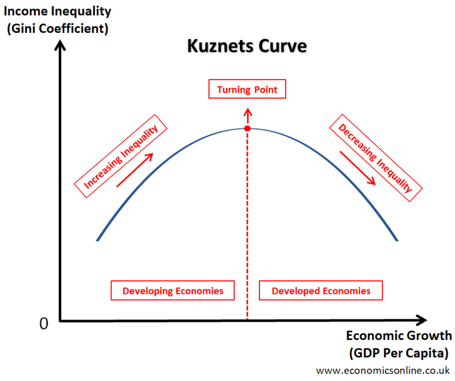
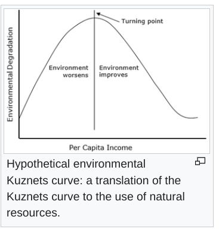

```{r setup, include=FALSE}
knitr::opts_chunk$set(echo = TRUE)
```

## Instructions

* For all computations based on permutation/bootstrapping, use $B = 1000$ replicates, and seed = $2024$ every time a permutation/bootstrap procedure is run.

* For Full Conformal prediction intervals, use a regular grid, where, for each dimension, you have $N = 10$ equispaced points with lower bound $min(data) - 0.25 * range(data)$ and upper bound $max(data) + 0.25*range(data)$. Moreover, do not exclude the test point when calculating the conformity measure. Except for the number of points, these are the default conditions of the `ConformalInference` R package.

* Both for confidence and prediction intervals, as well as tests, if not specified otherwise, set $\alpha = 0.05$.

* When reporting univariate confidence/prediction intervals, always provide upper and lower bounds.

* For solving the exam, you must use one of the templates previously provided and available [here](https://polimi365-my.sharepoint.com/:f:/g/personal/10816355_polimi_it/Ev5Iy-DxrFtGtFh-4kyGwbsBLpIn37d2D1xdNIqjnU0Oow?e=zS8Qeo).
Particularly, for each question you are required to report:
  * Synthetic description of assumptions, methods, and algorithms: which methodological procedure
you intend to use to answer the question, succinctly describing the main theoretical characteristics of the chosen approach, and why it is suitable for the analytical task at hand. For _e.g._, if you perform a statistical test, you should mention its assumptions, null and alternative hypotheses, and the test statistic.

  * Results and brief discussion: the actual result of the procedure applied to the data at hand, including any requested comment, output and plot.

_The files with the data are available_ [here](https://polimi365-my.sharepoint.com/:f:/g/personal/10794065_polimi_it/EspSDZeH6ZFJluO4dnEX2Y0B5i2P6JKVn1IiUUAZTFbwTA?e=gIR0LT)

## Exercise 1.
After reading [Doughnut Economics: Seven Ways To Think Like a 21st Century Economist](https://en.wikipedia.org/wiki/Doughnut_Economics:_Seven_Ways_to_Think_Like_a_21st-Century_Economist), Dr. LC Sulla is set out to test empirically whether the [Kuznets Curve and its environmental counterpart](https://en.wikipedia.org/wiki/Kuznets_curve) are verified in reality.

* Classical Kuznets curve: at first, growth increases with inequality and then wealth "lifts everyone up", reducing inequality.
<center>
{width=400px}^[Image taken from https://www.economicsonline.co.uk/definitions/the-kuznets-curve.html/]
</center> 

* Environmental Kuznets Curve (EKC): at first growth increases at the expense of environmental degradation. When people have sufficient income, the economy shifts to a less environment-degrading one. That is, after a turning point "economic growth cleans up".


As a first step to the analysis, Dr. Sulla is performing an exploratory analysis on the gathered data ( _cf_. `df1.csv` )^[The data for these exam are real and were processed from the original data present [here](https://www.kaggle.com/code/prakharrathi25/proving-the-environmental-kuznet-s-curve/notebook).] for year $2010$ with the following variables collected from different countries: `IncomeGroup`, `GDP_per_capita`, `C02_emissions`, `Gini_pct`, `Population`. 

1. Retrieve the country codes with the three highest Tukey depths when taking into account the three dimensions `GDP_per_capita`, `CO2_emissions_per_capita` and the `logit` transformation of the `Gini` coefficient (which is essentially a measure of inequality defined on $(0,1)$ ).^[Recall that $logit(x) = \ln \frac{x}{1-x}, x \in (0,1)$]. Which one of them is the median?

2. Focusing on those same dimensions, draw a bagplot matrix. Report the countries that are inside the bag of the `GDP_per_capita` versus `CO2_emissions` bagplot.^[Hint: The deepest 50% of the data are contained in the bag. Note that the bagplot compares only two dimensions at a time.]. Report which countries are outliers of such bagplot and remove them from the data set for the following exercises.

3. Without the aforementioned outliers in the dataset, implement through a permutational a MANOVA test for the equality of the multivariate mean (using `GDP_per_capita`, `CO2_emissions` and `logit(Gini)` ) of the three groups of countries according to `IncomeGroup`, utilising the Wilks statistic^[Remember that a smaller value of Wilks's Lambda is associated to a higher significance in the test]. Provide the histogram of the Monte Carlo approximation of the permutational distribution of the test statistic, the resulting p-value of the test and your conclusion.

4. Perform a Mann-Whitney U test comparing to test the median `CO2_emissions` of _Middle income_ countries and that of _High income_ countries. 

## Exercise 2

After some other touches to the data set (`df2.csv`), Dr. Sulla is ready to test for the existence of the Kuznets and the Environmental Kuznets curve.
<center>
{width=300px}^[Image source: Wikipedia]
</center>

</br>

1. Implement a quadratic fit utilising raw polynomials for the classical Kuznets curve (`CO2_emissions_per_capita` vs `GDP_per_capita`) and one for the Environmental Kuznets Curve (EKC) (`logit(Gini)` vs `GDP_per_capita`).  Provide a plot of the regression lines with parametric pointwise parametric prediction intervals and a table summarising the coefficients. Comment the results: are they coherent with the economic theory?

2. For the EKC model, compute the prediction bands for the regression using a full conformal approach and setting $\alpha = 0.1$ as the miscoverage level. Show it in a plot.

3. For the classical Kuznets curve, fit the following model for the $50$th quantile of  `logit(Gini)`:
$$
logit(Gini) =  \sum_{g \in \mathcal{G}} \beta_{g} +  f(GDP) + \epsilon
$$
 where $\mathcal{G}$ =  {Low income, Medium income, High income}, $f(GDP)$ is a function generated by the quadratic B-Spline basis with one interior knot at  `GDP_per_capita`$=30000$.
 Provide a table summarising the coefficients of the regression, including a comment on statistical significance.
 
4. After refitting the model with a suitable family of quantiles, utilise an (adaptive) nonparametric estimator to obtain a density of the prediction of the model at `GDP_per_capita`$=20000$, `g`$=$`High income`. Plot it and provide a $95%$ prediction interval of said conditioned random variable.

## Exercise 3

Before having a fallout with his (former) friend Dr. Marius^[Yes, we have named the characters after Roman dictator Lucius Cornelius Sulla and Roman consul Gaius Marius, who at first were friends and then enemies!], Dr. Sulla received from him a data set of smoothed functions for the observations `CO2_emissions` along time from $1990$ to $2010$, in an equally spaced grid of $100$ elements and only for `High income` and `Low income` countries. `ex3.rds` contains a list with the data frame and the time grid.

1. By suitably defining a functional data object, plot the resulting curves for the $N = 57$ countries. Build a functional boxplot without adjusting the F value and report which countries are magnitude outliers. 

Provide the (point-wise) $\alpha=0.1$-trimmed mean of each group ^[Hint: this reduces to the $\alpha$ - trimmed mean at every point of the grid for each income group.]. Add them the last plot. Calculate the pointwise p-value of the permutation test using as test statistic the difference of the $\alpha=0.1$-trimmed means ^[So at every time point there is a p-value of the local test] and interpret your results. 

3. Following the logic of the EKC, high and low income countries should produce different `C02_emissions`.  To see whether this is verified in the `C02_emissions` measured along time, perform a global permutation test for the equality of both functional $\alpha$-trimmed means of both gorups, the $L2$ distance between them. You can approximate it with the euclidean distance of the discretely sampled curves.


